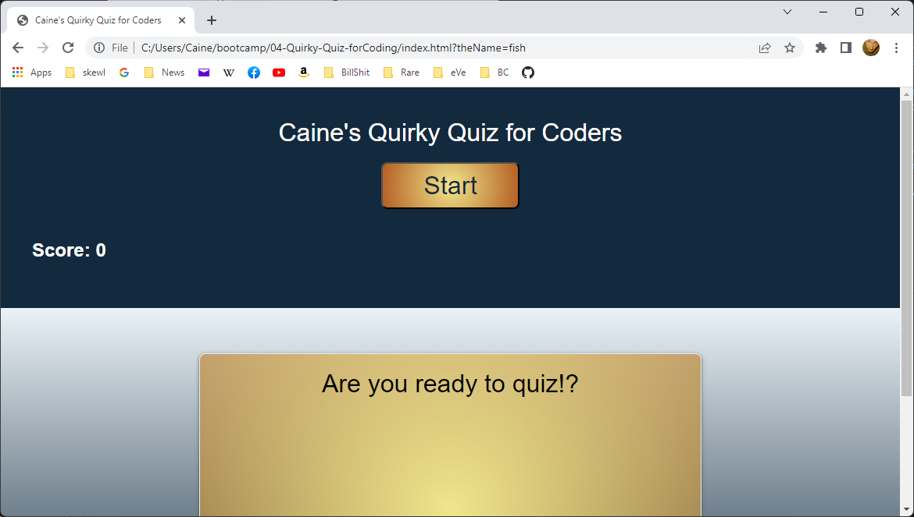

# 04-Quirky-Quiz-for-Coding
## By Caine Winters

### Screenshot of initial landing page for game.

### [Link to finished product](https://elcaine.github.io/04-Quirky-Quiz-forCoding//)

### Game mechanics
- Start button will, from initial landing page and/or after a completed game, start a new game.
- Submit button (displays after game completed game) will add user-entered name and score from the current round to score board.
- Submitting with no data entered will still store score, but with default '[no entry]' entered as name.
- Within script.js code file (line 8 as this README is currently being added to) is a commented-out line of code that can be uncommented to clear localStorage.
- Correctly answered questions add 10 points to current game's score.
- Wrong answers subtract 2 points from score and incur 10 second penalty reduction from timer.
- Game timer starts with 50 seconds.

### Acknowledged sources
Noted toward the end of script.js file:  randomizing array algorithm/logic taken from previous work done this code's author.